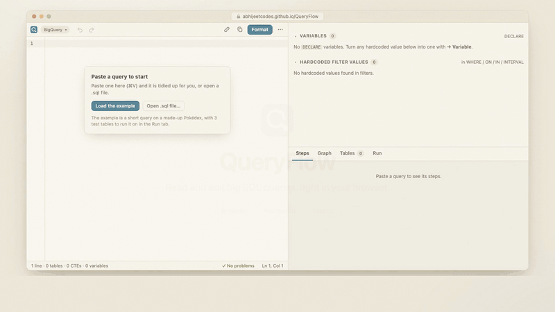
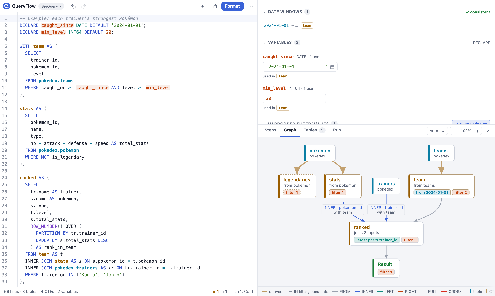
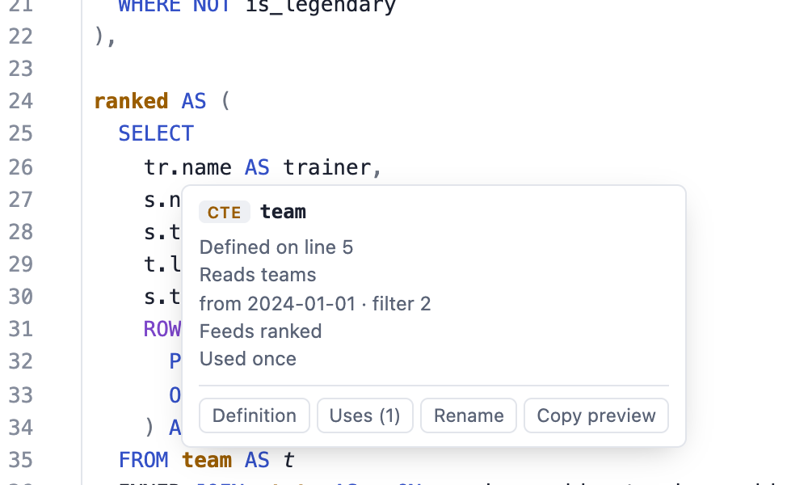
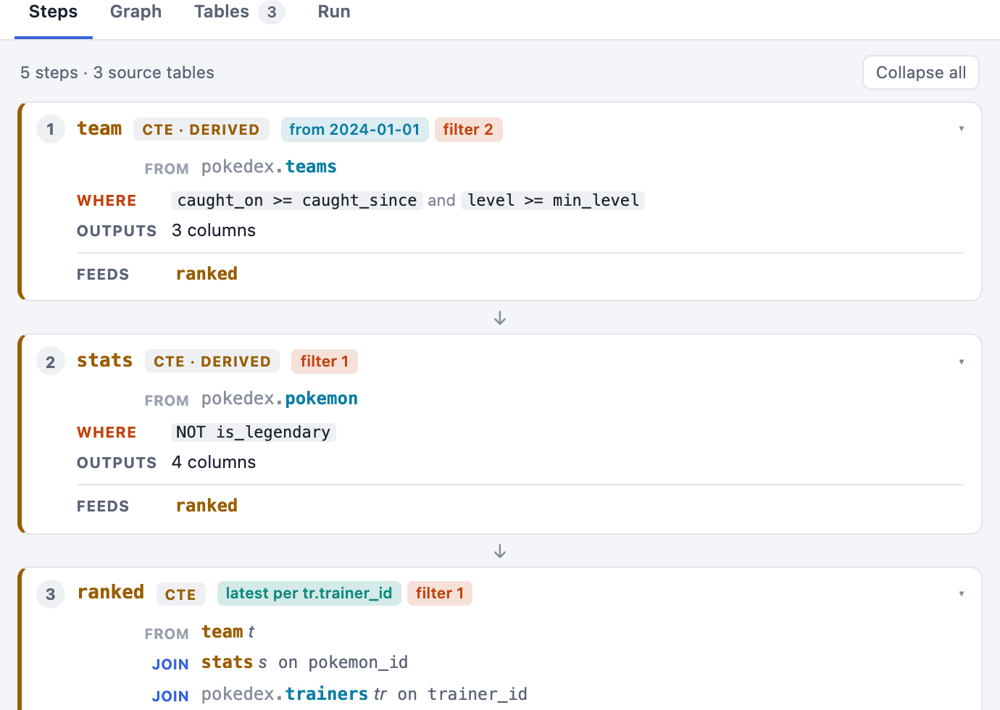
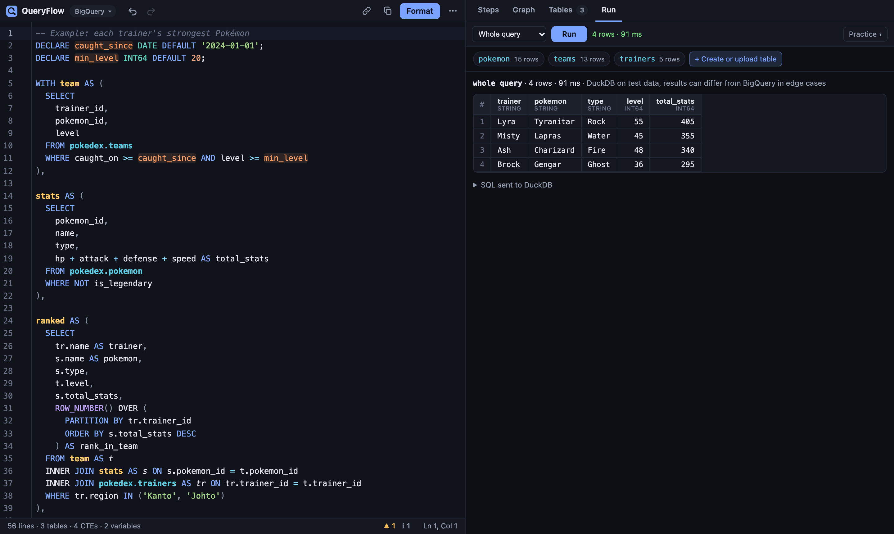

<div align="center">

#  QueryFlow

**A fast, private SQL editor for reading and editing big BigQuery, PostgreSQL and MySQL queries, right in your browser.**

Free · no login · no server · your SQL never leaves your browser

**[Open QueryFlow →](https://abhijeetcodes.github.io/QueryFlow/)**

<a href="docs/media/queryflow-intro.mp4"></a>

<sub>▶ <a href="docs/media/queryflow-intro.mp4">Watch the 100-second intro video</a></sub>

</div>

---

Inherited a 1,000-line query and need to change one date? Paste it into QueryFlow. It formats the
SQL, draws how the tables and CTEs join, explains each step in plain words, and lists every
variable and hardcoded filter value so you can change them in one place. It works like a code
editor for SQL: hover a name to see what it is, jump to where it's defined, rename it everywhere,
and catch the mistakes that quietly change your numbers. For BigQuery you can even **run the query
on small test tables** inside the browser before you copy it back to your database.

## Highlights

<table>
<tr>
<td width="50%" valign="top">

### 🧭 See how the query fits together

The **Graph** draws tables → CTEs → output, with join types, keys, filters, dedupes and date windows on each node. Click a node to jump to its SQL; double-click to focus its lineage.

</td>
<td width="50%" valign="top">

### 📋 Read it top to bottom

The **Steps** tab turns the query into a recipe: one card per CTE in execution order, saying what it reads, how it joins, what it filters or aggregates, and what it feeds.

</td>
</tr>
<tr>
<td valign="top">

### 🎛️ Every value in one place

Variables, `@parameters`, hardcoded filter values and date windows are listed on the right. Edit one there and every occurrence in the SQL follows. One click turns literals into `DECLARE`s.

</td>
<td valign="top">

### 🔎 Navigate it like code

Hover any CTE, table, alias or variable for a card that explains it. Go to definition (F12), find uses (⇧F12), rename everywhere (F2), and autocomplete CTE columns.

</td>
</tr>
<tr>
<td valign="top">

### ⚠️ Catch silent mistakes

Lint for the bugs that don't error out: a LEFT JOIN undone by a `WHERE`, fan-out joins inflating a `SUM`, mismatched date windows, `= NULL`, `NOT IN` with NULLs, unused CTEs, costly `SELECT *`.

</td>
<td valign="top">

### ▶️ Run it on test data (BigQuery)

Type, paste or upload small CSV / Excel tables and run the query with DuckDB compiled to WebAssembly, all in your browser. A built-in Pokédex practice database helps you learn SQL.

</td>
</tr>
<tr>
<td valign="top">

### ✅ Review before you copy

Copying back shows a diff against the query you pasted, so you see every change before it goes into production.

</td>
<td valign="top">

### 🔗 Share as a link

The query is compressed into the link's `#hash`, which browsers never send to the server, so sharing uploads nothing, not even to the host.

</td>
</tr>
</table>

## Screenshots

**The editor, with the variables panel and the join graph**



<table>
<tr>
<td width="52%" valign="top">

**Hover a name to see what it is**



</td>
<td width="48%" valign="top">

**The query as steps**



</td>
</tr>
</table>

**Run on test tables, right in the browser** (Midnight theme)



## Private by design

Everything runs client-side from the SQL text: no server, no login, no database connection. Your
query is kept in your browser's `localStorage`. The one thing the site sends is an anonymous count
to [GoatCounter](https://www.goatcounter.com/) (no cookies): the page view and the name of an action
such as `format/bigquery` or `run`, never your SQL. A share link
carries the query inside the link itself, and the test-run engine is served with the site and
never contacts anything else. That also makes QueryFlow a plain static site you can host anywhere
for free.

## Try it

Open **[abhijeetcodes.github.io/QueryFlow](https://abhijeetcodes.github.io/QueryFlow/)**, then:

1. Click **Load the example** on the empty editor (or ⋯ → *Load the example*). It loads a short
   query on a made-up Pokédex, each trainer's strongest Pokémon, with something for every feature:
   two variables, filter values, a date window, joins, a `ROW_NUMBER` dedupe and two lint warnings.
2. Or paste your own query. It's formatted on paste (⌘Z shows the original), and the dialect is
   detected from clues like `::` casts, `` `project.dataset` `` paths or `SET @variables`.
3. Press **⌘Enter** to run the example on its test tables, or open the Run tab's *Practice ▾* menu
   for seven guided SQL exercises.

## Features in detail

### Navigate and refactor

- **Hover a name** (CTE, table, alias, variable, `@parameter`) and a card says what it is. An alias shows the table it stands for and its join; a CTE shows what it reads, what it does and what it feeds; a variable shows its type and default. The card's buttons run the commands below.
- **Go to definition**: F12, or ⌘-click (Ctrl-click on Windows/Linux) a name. Hold ⌘ to see what's clickable. ⌘-click anywhere else still adds a cursor.
- **Find uses**: ⇧F12 highlights every occurrence and jumps to the next one each time you press it.
- **Rename** (F2): renames a CTE, alias, variable, `@parameter` or params-CTE value everywhere, in one undoable edit. Aliases are resolved per step, so renaming `o` in one CTE leaves another CTE's `o` alone. Names already in use and reserved words are refused.
- **Autocomplete**: CTEs, tables, variables and parameters from the query, plus the columns a CTE selects after `alias.`.
- **Fold** CTE bodies from the gutter (▾) to collapse a 500-line query down to its outline. The sticky header at the top names the CTE you're scrolled into; click it to jump to its start.

### Copy, share and save

- **Paste a whole query** and it is auto-formatted (⌘Z shows the original). Turn this off with "Format on paste" in the ⋯ menu.
- **Review before copy**: QueryFlow remembers the pasted query (after formatting) as the original. If you've changed it since, **Copy** (the copy icon, or ⌘⇧Enter) first shows a diff: removed and added lines, with the changed part of each line highlighted and unchanged stretches folded. Enter copies the edited SQL; you can also *Copy original* or *Mark current as original*. The **Changes +N −N** button opens the same view at any time. Untick "Always review before copying" to copy straight away.
- **Copy preview of a CTE** (⌘⌥Enter, the hover card, the graph's node card or the ⋯ menu): copies `WITH <the CTEs it needs> SELECT * FROM it LIMIT 100`, with the script's DECLAREs and temp functions in front, ready to run in BigQuery. It's the quickest way to check one step of a long query. A CTE nested inside another is lifted out too. (LIMIT doesn't lower the bytes BigQuery bills.)
- **Share link** (the link icon): copies a URL with the query compressed into its `#hash`. Browsers don't send the hash to the server, so the query isn't uploaded anywhere, not even to the host. Opening the link loads the query; ⌘Z brings back what you had. Very long queries make long links that some chat apps cut; save a `.sql` file for those.
- **Open / save files**: ⌘O, or drop a `.sql` file on the editor, to open it (formatted if "Format on paste" is on). ⌘⇧S downloads the query as `.sql`.

### Run on test data (BigQuery)

The **Run** tab (⌘Enter, or *Run on test data* in the ⋯ menu) runs the query on small tables you
type in, with [DuckDB](https://duckdb.org) compiled to WebAssembly. It all happens in your
browser: the engine is part of this site, loads on the first run (~8 MB, then cached) and never
contacts a server. Nothing is uploaded.

The tab is kept short: the Run button, one chip per table the query reads (with its row count),
parameter values, and the results. It takes the whole right column; the other tabs share it with
the Variables panel. Click a chip, or **+ Create or upload table**, to open the *Test tables*
dialog, where rows are typed, pasted and imported. Before the first run the results area says
what's missing, and **Fill with starter rows** puts made-up rows in every empty table at once.
With an empty editor it shows how to start: create a table, then write a query on it.

**Practice database.** For learning SQL, *Practice ▾* (top right of the Run tab, or *Load the
practice database* on an empty editor) loads a small made-up Pokédex: `pokedex.pokemon`,
`pokedex.trainers` and `pokedex.teams`, the same tables the editor's example reads. Seven
example queries go from `SELECT *` through filters, `GROUP BY`, joins, `LEFT JOIN`, dates and
CTEs with a window function. Picking
one puts it in the editor (⌘Z brings your query back), switches to BigQuery and runs it. The
tables are ordinary saved test tables, so they can be edited, and *Reset the practice tables*
puts them back.

- **One editor per source table** the query reads, in the dialog. Type or paste CSV, or cells copied from Excel / Google Sheets (they paste as TSV). Types are detected from the values; set one in the header with `name:TYPE` (`id:INT64`, `tags:ARRAY<STRING>`). Empty cells and `NULL` are NULL. *Table view* shows the rows as a grid.
- **Query a CSV or Excel file**: drop it anywhere on the page, or use *Query a CSV or Excel file…* on the empty editor (⌘O opens one too). In an empty editor it becomes a table, `SELECT * FROM <file name> LIMIT 100` goes in and runs, switching to BigQuery if needed.
- **Import CSV and Excel files**: *Upload files…*, or drop `.csv`, `.tsv` or `.xlsx` files on the page or the dialog (or on the table being edited). A file named like a table the query reads (`orders.csv` for `proj.shop.orders`) fills that table; any other file becomes a saved test table of that name. CSV saved by Excel works as it is, including the byte-order mark and `;`-separated files. A bigger file keeps its header and first 1,000 rows (or 200k characters); its chip shows `1,000 of 48,213` and the results say the counts cover only those rows.
- **Excel workbooks** (`.xlsx`, `.xlsm`): every sheet with cells becomes a table. A sheet named like a table the query reads fills it, so one workbook with `orders` and `users` sheets fills both; a one-sheet file is named after the file, and `Sheet1`-style sheets after the file plus a number. The first non-blank row is the header. Dates and times are read from the cell formats (`2024-01-15`, `2024-01-15 10:30:00`), TRUE / FALSE become booleans and error cells (`#N/A`) become NULL; formulas give the value Excel last calculated. The workbook is read in the browser by QueryFlow's own small reader, with no library and no upload. Old `.xls` files need saving as `.xlsx` or CSV first.
- **Your own test tables**: *+ New table* adds a table by name, without writing `CREATE TABLE` / `INSERT`. Adding and importing work in every dialect; only running needs BigQuery. The Tables tab's *Add test data…* opens the Run tab. Saved tables are kept for every query: one is used when a query reads a table with that name, and a short name serves the full path (`orders` → `proj.shop.orders`, `shop.orders` beats `orders`) while that query's own box is empty. The editor says which table it stands in for.
- **Columns from query** writes the header for you: the columns the query reads from that table. **Starter rows** adds 3 made-up rows that fit the query: ids 1–3 so joins match, values from its `=` / `IN` filters, dates inside its date window. Tables used only in `NOT IN` / `NOT EXISTS` filters get ids from 101, so they don't filter everything out.
- **Query parameters**: give each `@param` a SQL value (`'SG'`, `42`, `DATE '2024-01-01'`). `DECLARE` variables use their defaults, so edit those in the editor or the Variables panel (on the other tabs).
- **Whole query or one CTE**: the target menu runs everything, or the script up to a chosen CTE (also *Run* in a CTE's graph card). Temp tables, temp functions and `SET` work like in a BigQuery script; the result is the last query, or the table the script wrote last.
- **Results** show up to 1,000 rows with BigQuery-style values. Errors name the editor line, and *SQL sent to DuckDB* shows exactly what ran. Editing the query afterwards dims the rows until the next run.
- **Limits**: up to 20 tables per run, and 1,000 rows, 60 columns and 200k characters per table. Test tables are kept in this browser (`localStorage`, 1.5 MB in all) per table name, so they come back for the next query that reads the same table. *Clear all* in the dialog removes them.

**How close is it to BigQuery?** QueryFlow rewrites the query for DuckDB: table names, strings, `SAFE_CAST`, `SAFE_DIVIDE`, `DATE_TRUNC` / `DATE_ADD` / `DATE_DIFF` (argument order, Sunday weeks, DATE results), `EXTRACT(DAYOFWEEK …)`, `FORMAT_DATE` / `PARSE_DATE`, `UNNEST … WITH OFFSET`, `IN UNNEST`, `[OFFSET(n)]`, `STRUCT(…)`, `SELECT * EXCEPT`, `ARRAY_AGG(… IGNORE NULLS … LIMIT n)`, `COUNTIF`, regex and JSON functions, `DECLARE` / `SET`, temp functions, and NULLs sorting first. QUALIFY, window functions, `GROUP BY ALL` and most other SQL run as they are. Not supported: scripting blocks (`IF`, `LOOP`, `BEGIN … END`), JavaScript UDFs, `SELECT AS STRUCT`, ML / GIS functions and time zones (everything is UTC). Treat a run as a logic check on a handful of rows; edge cases such as float rounding can differ from BigQuery.

### Variables and filter values

- **Edit a value on the right** and every occurrence in the SQL changes as you type.
- **→ Variable** on a hardcoded value or parameter adds `DECLARE v_x TYPE DEFAULT …;` (MySQL: `SET @v_x = …;`) at the top and replaces every occurrence. PostgreSQL has no script variables, so there it isn't offered.
- **use start_date** appears when a hardcoded value equals an existing variable's value.
- **→ all to variables**: one click turns every hardcoded filter value into a `DECLARE` (MySQL: `SET @…`). In BigQuery an all-literal `IN (…)` list becomes an ARRAY variable used as `IN UNNEST(v)`, and a value equal to an existing variable reuses it. One ⌘Z undoes it.
- **Params CTEs**: a CTE with no FROM, like `params AS (SELECT DATE '2025-01-01' AS start_date, 'SG' AS country)`, is treated as a set of constants. Its values are editable in the Variables panel, with the comment next to each value shown as a hint. Its cross-join edges are hidden, each step that reads it gets a `uses params` chip, and cross-joining it doesn't trigger the comma-join warning, since it's a single row.
- **Hover** a row to highlight its uses. **Click** a name or the `×N` count to jump through them.

### Graph and Steps

- **Click a graph node** to jump to it in the SQL, dim unrelated lineage, and see its joins with ON conditions. Click again to cycle through references. **Hover a node** to light up only it and its direct inputs.
- **Focus lineage**: double-click a node, or use "Focus lineage" in its card, to draw only what feeds it and what it feeds.
- **Graph → filters**: click a node (or a step name in Steps) and the filter panel shows only that step's hardcoded values, including those in its nested subqueries. Variables it doesn't use are dimmed. Each value has a step tag; click it to jump to that node. "show all" resets.
- **Steps tab**: one card per CTE / output in execution order. Each card lists what it reads (join type and keys), what it does (filters, aggregation, dedupe, window, union, limit) and what it feeds. FROM-subqueries are nested inside the step that uses them.
- **Derived tables**: a CTE or subquery built from a single input gets a thick "derived" edge in the graph, a "from X" subtitle, and chips such as `filter 2`, `Σ by product_id` or `latest per product_id`. The last one is the `ROW_NUMBER() … rn = 1` dedupe pattern, found in QUALIFY, WHERE or the join's ON.
- **Subquery filters**: `WHERE x IN (SELECT … FROM T)` and `EXISTS (…)` only keep or drop rows; they don't bring in data. They show as an `in T` chip on the node instead of an edge, which keeps graphs readable when many CTEs filter by the same base CTE. "Show links" in the graph toolbar draws them as dotted edges.
- **Window functions**: each one gets a card in the graph's node detail and in Steps, with the output column, what it computes in plain words (*running sum*, *rolling avg*, *dense rank*, *previous value*, *count per group*…), its **per** (PARTITION BY) and **order** (ORDER BY, ↑ asc / ↓ desc) keys, and any frame. Named windows (`OVER w`, `WINDOW w AS (…)`) are resolved. Click a card to select the expression in the editor.
- **Graph direction**: `auto` picks left-to-right or top-to-bottom, whichever fits the panel better. Click it to force one.

### Checks

- **Date windows**: every date bound in WHERE / ON / HAVING / QUALIFY is resolved to a day, whether it comes from a literal, a variable, a params CTE value, `DATE_SUB(…, INTERVAL n DAY)`, `CURRENT_DATE() / NOW()` or `CURRENT_DATE - INTERVAL '7 days'`. From these each step gets a window. The *Date windows* section, the lint and the date chips on graph nodes flag a step whose start or end differs from the others. They also flag a partition filter (`_PARTITIONDATE`, `_PARTITIONTIME`, `_TABLE_SUFFIX`) that is narrower than the window, which silently drops rows, and one far wider than needed (extra bytes). Steps that share the same window and have no issue collapse into one row; click a date to step through them. "align" fixes a mismatched hardcoded date. Exclusive bounds count as inclusive days: `< '2024-04-01'` ends on 03-31.
- **Joins that change the numbers**: two warnings for silent wrong answers.
  - *An outer join undone later*: a `WHERE` condition on a LEFT JOIN's columns (`WHERE b.status = 'x'`), or a later INNER JOIN on them, is false for the rows the LEFT JOIN kept with NULLs, so it drops them and the LEFT JOIN works as an INNER JOIN. Conditions that handle NULL (`IS NULL`, `OR`, `COALESCE`, `IFNULL`, `IF`, `CASE`) aren't flagged. RIGHT and FULL joins are checked the same way.
  - *Fan-out added up*: a CTE with one row per `(user_id, day)` (its GROUP BY, or a `QUALIFY ROW_NUMBER() … = 1` dedupe) joined on `user_id` alone matches each row several times. That's normal for a one-to-many join, so it's only flagged when a `SUM`, `AVG`, `COUNT` or `COUNTIF` in that step adds up columns of the repeated side. `COUNT(DISTINCT …)`, `MIN` and `MAX` are safe.
- **Other lint**: `= NULL` (never true), `NOT IN (subquery)` with possible NULLs, `LAST_VALUE` with ORDER BY and the default frame (returns the current row), a JOIN without ON, comma joins, `ORDER BY` in a CTE without LIMIT, unused CTEs and variables, CTEs or aliases defined twice and unbalanced parentheses. In BigQuery also `SELECT *` (bills every column), a column named like a variable (the column wins), DECLARE after other statements, `UNION` without ALL / DISTINCT and legacy `[project:dataset.table]` references. ⌘⇧M lists them all.

### Look and feel

- **Light / dark**: four themes in the ⋯ menu. It follows your system setting until you pick one.
- **Resizable panes**: drag the gutters between the editor and the panels. Sizes are remembered.

## Dialects

Pick **BigQuery**, **PostgreSQL** or **MySQL** next to the logo. The choice is remembered and
travels with share links. It decides how the text is read (quotes, comments, parameters),
highlighted, formatted and checked; the graph, steps, rename and previews work the same in all three.

| | BigQuery | PostgreSQL | MySQL |
|---|---|---|---|
| Quoted names | `` `proj.ds.t` `` | `"Name"` | `` `name` `` |
| Variables | `DECLARE x TYPE DEFAULT …` | none in plain SQL: a params CTE plays that role | `SET @x = …` |
| Parameters | `@name` | `$1`, `:name` | `@x` that no `SET` defines |
| Also understood | `QUALIFY`, `UNNEST`, `FOR SYSTEM_TIME AS OF` | `::` casts, `$$` strings, `DISTINCT ON` (a dedupe), `LATERAL`, `CURRENT_DATE - INTERVAL '7 days'` | `#` comments, `:=`, `DATE_SUB(CURDATE(), INTERVAL 7 DAY)`, `CREATE TABLE t SELECT …` |
| BigQuery-only lint | `UNION` needs ALL / DISTINCT, DECLARE first, `SELECT *` billing, legacy `[p:d.t]`, variable shadowed by a column | – | – |

Switching dialect re-reads the same text; an untouched example query is swapped for that dialect's example.

**Detect dialect on paste** (on by default, in the ⋯ menu): pasting or opening a whole query that
clearly belongs to another dialect switches to it, and the toast says why (`:: casts`,
`` `project.dataset` `` paths, `SET @variables`, `LIMIT 10, 20`, …). Clues inside comments and strings
don't count, and SQL that runs anywhere, or has clues for two dialects, leaves the choice alone.

## Layout

| Left | Right top | Right bottom |
|---|---|---|
| Editor: highlighting for the chosen dialect, lint squiggles, folding, autocomplete, hover cards, and a sticky header naming the CTE you're scrolled into | **Variables** (`DECLARE`, `SET @var`, params CTE), **parameters**, **hardcoded filter values**, **date windows** | **Steps** (the query as a top-to-bottom recipe), **Graph** (tables → CTEs → output), a **Tables** list and **Run** (test tables and results) |

On phones the views switch from a bar at the bottom, one at a time, and the graph can be pinch-zoomed.

## Keyboard

| Mac | Windows / Linux | Action |
|---|---|---|
| ⌘⇧F or ⌘S | Ctrl+Shift+F or Ctrl+S | Format |
| ⌘Enter | Ctrl+Enter | Run on the test tables (Run tab, BigQuery) |
| ⌘⇧Enter | Ctrl+Shift+Enter | Copy SQL (reviews the diff first if you've edited the pasted query) |
| ⌘⌥Enter | Ctrl+Alt+Enter | Copy a preview query for the CTE at the cursor |
| F12 or ⌘-click | F12 or Ctrl+click | Go to definition |
| ⇧F12 | Shift+F12 | Next use of the name under the cursor |
| F2 | F2 | Rename everywhere |
| ⌘O / ⌘⇧S | Ctrl+O / Ctrl+Shift+S | Open a `.sql` file / save as `.sql` |
| ⌘⇧M | Ctrl+Shift+M | List all problems |
| ⌘Z / ⌘⇧Z | Ctrl+Z / Ctrl+Y (also Ctrl+Shift+Z on Linux) | Undo / redo, including edits made from the side panels |
| ⌘F | Ctrl+F | Find and replace |

In Chrome on Windows and Linux, F12 opens the developer tools; use Ctrl-click or the hover card's *Definition* button instead.

## Run locally

```bash
npm install
npm run dev        # http://localhost:5199
```

`npm test` runs the analyzer, formatter, diff, navigation and test-run tests (the last run real SQL
on DuckDB's Node build). `npm run build` writes the static site to `dist/`.

## Host your own copy

QueryFlow is a static site, so you can run your own copy for free.

### GitHub Pages

`.github/workflows/pages.yml` runs the tests, builds and deploys on every push to `main`.
The build uses relative paths, so it works under the repository's sub-path.

1. Fork this repository on GitHub. Free Pages needs a public repository on a personal plan.
2. In your fork, open *Settings → Pages* and set *Source* to **GitHub Actions**.
3. Push to `main`, or run the workflow from the *Actions* tab. When the deploy finishes, the editor is live at
   `https://<user>.github.io/QueryFlow/`. Every later push to `main` redeploys it, and a failing
   test stops the deploy.

Share links point at whatever address the page is served from, so links copied from the
GitHub Pages site open there for anyone.

### Other free hosts

| Host | Free URL | Setup |
|---|---|---|
| **Cloudflare Pages** | `queryflow.pages.dev` | *Workers & Pages → Create → Pages → Connect to Git*. Build command `npm run build`, output directory `dist`. Cloudflare Pages rejects files over 25 MB, and the DuckDB engine behind the Run tab is ~36 MB, so prefer another host if you want test runs. |
| **Netlify** | `queryflow.netlify.app` | *Add new site → Import from Git*, or drag the `dist/` folder onto app.netlify.com/drop. Build command `npm run build`, publish directory `dist`. |
| **Vercel** | `queryflow.vercel.app` | *Add New → Project*, framework preset *Vite*. |

All of them, and GitHub Pages, can also serve a custom domain you own.

## How it fits together

For contributors: a map of the source.

| File | Role |
|---|---|
| `src/dialect.js` | BigQuery / PostgreSQL / MySQL: quoting, comments, parameters, variables, dialect-only lint |
| `src/tokenizer.js` | Tolerant SQL tokenizer for the three dialects; never throws |
| `src/analyzer.js` | Heuristic analysis: CTEs, joins, variables, filter values, date windows, lint |
| `src/shape.js` | What each step does (filters, aggregation, dedupe, windows) |
| `src/scope.js` | Which table or CTE an alias means at a position; CTE columns for autocomplete |
| `src/symbols.js` | The name at a position, its definition and uses; rename edits; CTE preview SQL |
| `src/symbol-ui.js` | Hover card, go to definition, find uses, rename box |
| `src/share.js` | Share links: deflate + base64url in the `#hash` |
| `src/format.js` | sqlfluff-style formatting on top of `sql-formatter` (loaded on first use) |
| `src/editor.js` | CodeMirror setup: dialect, marks, lint, folding, completions |
| `src/vars-panel.js` | Variables, parameters, filter values and date windows panel |
| `src/graph-panel.js`, `src/graph-layout*.js` | Lineage graph (dagre; big graphs lay out in a Web Worker) and Tables list |
| `src/steps-view.js` | Steps tab |
| `src/diff.js`, `src/diff-view.js` | Review-before-copy diff |
| `src/bq2duck.js` | BigQuery → DuckDB translation for test runs (token rewrite that keeps line numbers) |
| `src/testdata.js` | Test tables: CSV / TSV parsing, limits, columns the query reads, starter rows |
| `src/runner.js`, `src/engine.js` | A test run (load tables, run statements, cap rows) and the DuckDB-WASM driver |
| `src/xlsx.js` | Reads `.xlsx` workbooks into CSV (zip via the browser's `DecompressionStream`; loaded on first use) |
| `src/run-panel.js` | Run tab |
| `src/practice.js` | The practice database (a made-up Pokédex) and its example queries |
| `src/sample.js` | The editor's example: a Pokédex query per dialect, on the practice tables (loaded on first use) |
| `src/main.js` | Wires it together: toolbar, status bar, theme, panes, files, share links |

## License

[MIT](LICENSE). Free to use, change and host, including commercially.
